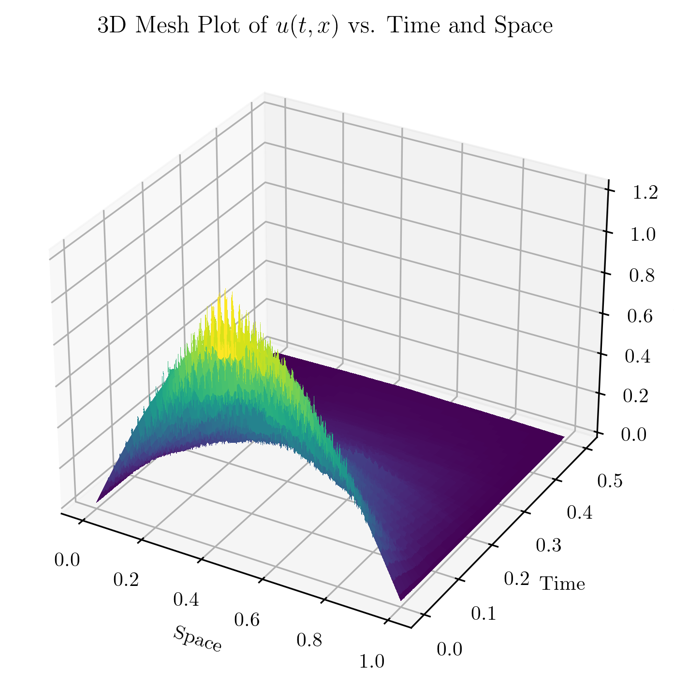

# Simulation of SHE with positivity-preserving splitting scheme

This repository provides a Python implementation of a positivity-preserving splitting scheme for the Stochastic Heat Equation (SHE) on the spatial domain (0,1) with homogeneous Dirichlet boundary conditions. The simulation results are visualized through 3D plots and MP4 animations.

## Visuals

The following visuals are generated by running the `demo.sh` script, which utilizes the `she-sim-config.yaml` configuration file.



<video controls src="Demo_2-1_2d.mp4" title="2D Animation of u(t,x)"></video>

## Table of Contents

- [Installation](#installation)
- [Usage](#usage)
- [Generated Output Files](#generated-output-files)
- [Contributing](#contributing)
- [License](#license)
- [Acknowledgements](#acknowledgements)

## Installation

To set up the project, follow these steps:

1.  **Clone the repository:**

    ```bash
    git clone https://github.com/lzc0090/SHE_Positive-preserving_Simulation.git
    cd SHE_Positive-preserving_Simulation
    ```

2.  **Create and activate a virtual environment (recommended):**

    ```bash
    python -m venv .venv
    source .venv/bin/activate  # On Windows, use `.venv\Scripts\activate`
    ```

3.  **Install the package:**

    ```bash
    pip install .
    ```

## Usage

To run the simulation with default parameters and generate plots, use the following command:

```bash
she-sim
```

You can also customize the simulation using command-line arguments or a YAML configuration file.

### Command-line Arguments

```bash
she-sim --seed <seed> --samples <samples> --output <output_prefix> --alphaN <alphaN> --T <T> --discretization_level <discretization_level> --fps <fps> --max_animation_frames <max_animation_frames> --no-plot
```

-   `--seed`: Random seed for the simulation (default: 93).
-   `--samples`: Number of Monte Carlo samples (default: 4).
-   `--output`: Prefix for the output file names (default: `msSupDxDt`).
-   `--alphaN`: Noise strength parameter (default: 1.0).
-   `--T`: End time of the simulation (default: 0.5).
-   `--discretization_level`: Level of spatial discretization (default: 10). The spatial step size `h` is calculated as `2**(-discretization_level)`.
-   `--fps`: Frames per second for the animation (default: 10).
-   `--max_animation_frames`: Maximum number of frames for the animation (default: 120).
-   `--no-plot`: Suppress the generation of plots.

### Configuration File

You can also provide a YAML configuration file using the `--config` option. Command-line arguments will override values specified in the configuration file.

Example `she-sim-config.yaml`:

```yaml
seed: 123
samples: 10
output: custom_output
alphaN: 0.8
T: 1.0
discretization_level: 8
fps: 15
no-plot: false
```

To run with a configuration file:

```bash
she-sim --config she-sim-config.yaml
```

## Generated Output Files

Running the simulation will generate `.npz`, `.png`, and `.mp4` files in the root directory. These files are generated by the `demo.sh` script (or by running `she-sim` directly).

-   `.npz` files: Contain the simulation data.
-   `.png` files: 3D plots of the simulation results (e.g., `msSupDxDt_sample_1_3d.png`).
-   `.mp4` files: 2D animations of the simulation results (e.g., `msSupDxDt_sample_1_2d.mp4`).

## Contributing

We welcome contributions to this project! If you'd like to contribute, please follow these steps:

1.  **Fork the repository.**
2.  **Clone your forked repository** to your local machine.
3.  **Create a new branch** for your feature or bug fix: `git checkout -b feature/your-feature-name` or `git checkout -b bugfix/issue-description`.
4.  **Make your changes** and ensure they adhere to the existing code style and conventions.
5.  **Write and run tests** to ensure your changes work as expected and don't introduce regressions.
6.  **Commit your changes** with a clear and concise commit message.
7.  **Push your branch** to your forked repository: `git push origin feature/your-feature-name`.
8.  **Open a Pull Request** to the `main` branch of the original repository. Provide a detailed description of your changes.

## License

This project is licensed under the [CC BY 4.0](https://creativecommons.org/licenses/by/4.0/) License.

## Acknowledgements

These MATLAB scripts support the results published in:

Bréhier, Charles-Edouard; Cohen, David; Ulander, Johan.
"Analysis of a positivity-preserving splitting scheme for some semilinear
stochastic heat equations." *ESAIM: Mathematical Modelling and Numerical
Analysis* 58(4):1317–1346, 2024. DOI:
<https://doi.org/10.1051/m2an/2024032>.

Some functions were translated from the original MATLAB code available at [Zenodo](https://zenodo.org/records/10300733) to Python.

Further background and a brief podcast discussion can be found in the
official reference entry at
<https://spdes-bib.readthedocs.io/en/latest/bib_entries/brehier.cohen.ea:24:analysis.html>.

The code is translated from Matlab to Python by Le Chen. Le Chen would like to thank David Cohen for his help in understanding the original MATLAB code.